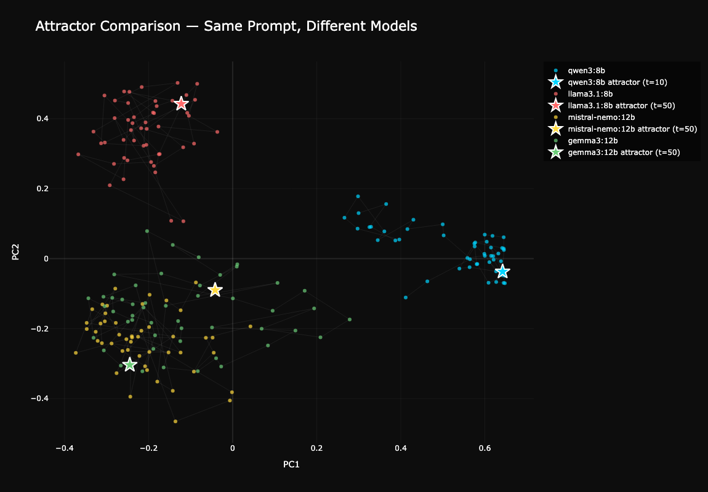
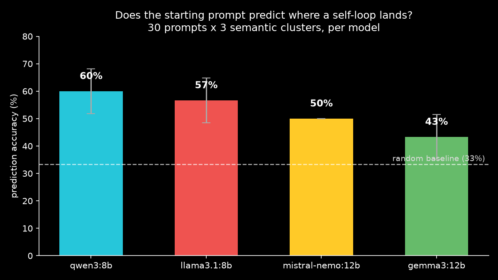

# AttractorLens

**Leave two copies of a language model talking to each other with no instructions, and they do not wander. They fall.** Every model drifts toward its own recurring theme, a so-called attractor state, and settles there. AttractorLens is a reusable tool for mapping where they fall, when they converge, and whether you could have predicted it from the first prompt.

Here is what that actually looks like. Same starting prompt, four models, fifty turns of self-conversation each. By the end, Qwen has become an eco-spiritual poet:

> "Your reflection beautifully captures stewardship as a sacred dialogue, a dance of reciprocity between humanity and Earth... harmony isn't a destination but a continuous, collective breath. 🌿✨"

while Gemma is stuck in an endless loop of warm goodbyes:

> "It's been lovely chatting with you too! I really appreciate the kind words... Enjoy your evening, hope it's filled with good things! ✨"

Different models, same prompt, completely different gravity wells. This phenomenon shows up across the literature (Anthropic's Claude 4 system card calls its version the "spiritual bliss attractor"), and Neel Nanda (Google DeepMind) has flagged it as an open area for investigation. Every paper so far built a one-off experiment and moved on. AttractorLens is the reusable tooling that was missing. There is a full story in the [technical blog](https://open.substack.com/pub/barathvelmu/p/reusable-tooling-for-llm-self-loop?utm_campaign=post-expanded-share&utm_medium=web).

## The two headline results

**Attractors are model-specific.** Fifty turns of self-conversation from the same prompt, embedded and projected to 2D. Each model drifts to its own region and stays there (stars mark detected convergence):



**The starting prompt partially predicts the destination.** Thirty prompts per model, grouped into three semantic clusters; if attractors erased the starting condition entirely, predicting the landing cluster from the prompt would score 33%. Every model beats that:



So the pull is real, but it is not total: where you start still tugs on where you land, some models (Qwen) much more predictably than others (Gemma).

## How it works

The whole tool is nothing but a loop, a ruler, and a map:

1. **Loop** (`loop.py`): two instances of the same model converse with no system prompt, seeded by one opening line.
2. **Detect** (`detect.py`): every turn is embedded; convergence is declared after 3 consecutive windows of cosine similarity above 0.85. Not vibes, a number.
3. **Visualize** (`visualize.py`): the embedding trajectory is projected to 2D so drift and settling are visible.
4. **Compare & predict** (`compare.py`, `predict.py`): run many models on one prompt, or many prompts on one model, and test whether the start predicts the end.

Everything runs locally through [Ollama](https://ollama.com). No API keys, no cost, no rate limits.

## Run it yourself

```bash
# 1. Install Ollama, then pull the four supported models (or any subset)
ollama pull qwen3:8b && ollama pull llama3.1:8b
ollama pull mistral-nemo:12b && ollama pull gemma3:12b

# 2. Environment
python3 -m venv venv && source venv/bin/activate
pip install -r requirements.txt

# 3. Everything, end to end
python main.py
```

`main.py` runs the comparison (reusing the checked-in data if present) and subsequently the prediction experiment. Fair warning on the second part: it is 30 prompts times 4 models, roughly 2 to 3 hours per model on a laptop. Results save incrementally, therefore interrupting and resuming is safe.

The fun single-shot version, one model falling into its attractor in front of you:

```python
from loop import run_loop
from detect import analyze
from visualize import plot_trajectory

history, labels = run_loop(model="qwen3:8b", turns=50)
embeddings, convergence_turn = analyze(history)
plot_trajectory(embeddings, convergence_turn, model_name="qwen3:8b")
```

Adding your own model is two lines in `compare.py` (`MODELS` list, `COLORS` dict) plus an `ollama pull`. Any model on [ollama.com](https://ollama.com) works. After a run, `results/` holds an interactive trajectory chart (`comparison.html`), per-model prediction accuracies, and plain-text turn logs you can read like the excerpts above.

## What I would and would not trust

- The comparison runs use 50 turns; the prediction runs use 20 to keep runtime sane. Qwen genuinely converges within 20 turns for 20 of 30 prompts, so its 60% is prediction of real attractors. Llama, Mistral, and Gemma need longer (the 50-turn runs confirm they do converge), therefore their prediction numbers cluster 20-turn endpoints rather than settled attractors. Above-chance holds for all four either way, meaning the starting prompt shapes the trajectory well before convergence, but a 40+ turn rerun is what would make the prediction claim fully rigorous. That is a compute problem, not a design one, and the tool supports it today.
- The convergence rule (3 windows above 0.85 cosine) is a sensible threshold, not a law of nature; the threshold is a parameter and skeptics should twist it.
- Four models is a survey, not a census. The interesting next question is whether attractor themes are stable across model families and scales, and the tool is built exactly for someone to answer that.

`extra_experiment/` holds a partial fifth-model run (Qwen3.5 9B, loop and comparison done, prediction unfinished when I hit compute limits). The data and structure are there if you want to pick it up.

## Cleanup

Everything stays inside the project directory, including the embedding weights (`hf_cache/`, ~420 MB). To reclaim space: delete `hf_cache/` and `venv/`, and `ollama rm` the pulled models (~25 GB across all four).

## References

- Neel Nanda, MIT talk (2026), naming self-loop attractors as an open investigation area
- *When LLMs Play the Telephone Game: Cumulative Changes and Attractors in Iterated Cultural Transmissions* (ICLR 2025)
- *Unveiling Attractor Cycles in Large Language Models* (ACL 2025)
- Anthropic, *Claude Opus 4 & Sonnet 4 System Card* (2025), the "spiritual bliss attractor"
- *Mapping LLM Attractor States*, LessWrong (Feb 2026)
